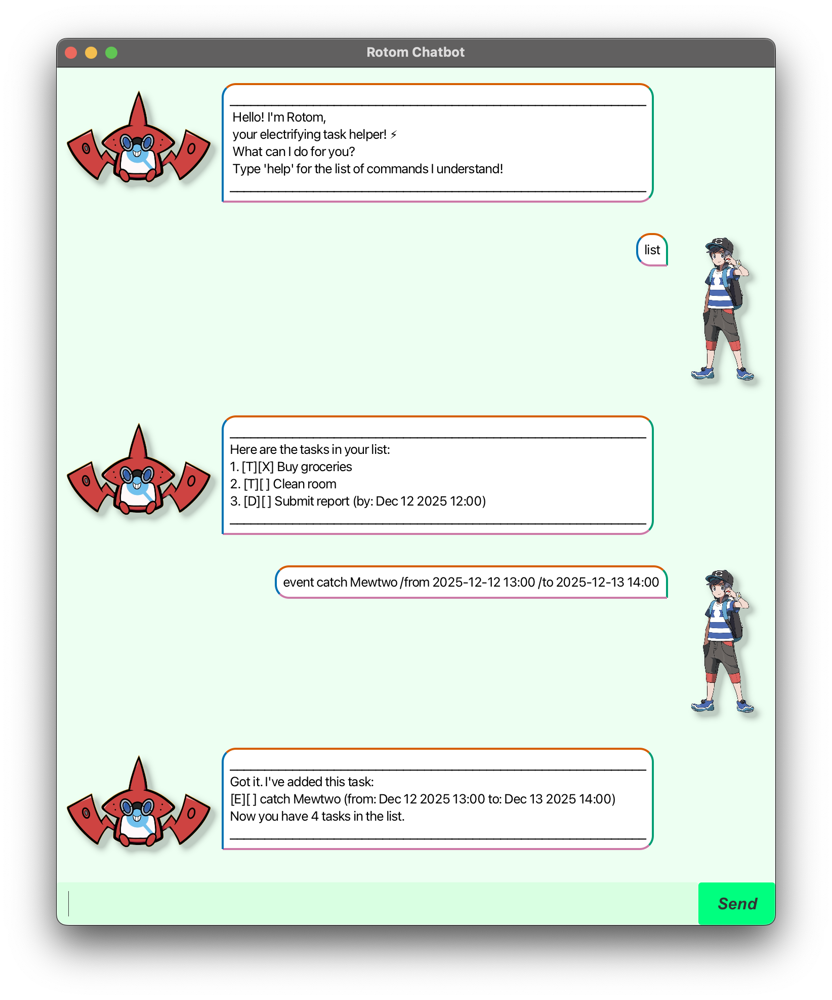

***
### **Getting Started with Milo**



Hey there! This guide will help you get the most out of Milo, your new chat-based task manager. Think of it as a simple, text-powered assistant for your to-do list. Just type your commands, and Milo will handle the rest.

When in doubt, just type `help` directly in Milo for a quick refresher.

---

### **First Steps**

1.  **Open up Milo.**
2.  Let's see what it can do. Type **`help`** for the full list of commands.
3.  Go ahead and add your first task. Try something like **`todo Read that new book`**.
4.  Use commands like **`list`**, **`mark 1`**, or **`show 2025-09-20`** to see and manage everything.

**A Quick Note on Dates:**
Milo likes things neat and tidy. Please use these formats so it understands you perfectly:
*   For a full day: **`yyyy-MM-dd`** (e.g., `2025-09-20`)
*   For a specific time: **`yyyy-MM-dd HH:mm`** (e.g., `2025-09-20 14:30`)

---

### **How to Add a Deadline**

Deadlines are easy. Just tell Milo what you need to do and when it's due.

**Just type:**
`deadline [Your Task] /by [yyyy-MM-dd HH:mm]`

**Here's a real example:**
```
deadline Finish the quarterly report /by 2025-09-20 23:59
```

**And here's what Milo will say back:**
```
Got it. I've added this task:
  [D][ ] Finish the quarterly report (by: Sep 20 2025 23:59)
Now you have 5 tasks in the list.
```

---

### **The Command Cheat Sheet**

Here’s the lowdown on everything you can tell Milo to do.

**Looking at Your Tasks**
*   **`list`**
    Shows you every single task, in the order Milo has them stored.
*   **`show 2025-09-20`**
    Gives you a quick view of everything happening on a specific day.
*   **`find book`**
    Searches your tasks for that word (it's not case-sensitive). Great for when your list gets long!

**Changing Tasks**
*   **`mark 3`** / **`unmark 3`**
    Checks a task off your list (or un-checks it if you change your mind). Use the number from the **`list`** view.
*   **`delete 2`**
    Gets rid of a task for good. Again, use the number from the main **`list`**.

**Adding New Tasks**
*   **`todo Buy more coffee`**
    Adds a simple, classic to-do.
*   **`deadline Send email /by 2025-09-21 10:00`**
    Adds a task with a due date and time.
*   **`event Team lunch /from 2025-09-22 12:30 /to 2025-09-22 13:30`**
    Adds an event that has a start and end time.

**Handy Tools**
*   **`sort`**
    Reorganizes your entire master list chronologically. Fair warning: this changes all the task numbers!
*   **`undo`**
    Whoops! Made a mistake? This will undo your last action (like adding, deleting, or marking). You can often undo multiple times in a row.
*   **`reset`**
    Completely wipes your task list. Use this one carefully!
*   **`bye`**
    politely closes Milo.

---

### **Let's See It in Action**

**Want to see what's on your plate for a specific day?**
```
show 2025-09-20
```
Milo might show:
```
Tasks on 2025-09-20:
1. [D][ ] Finish report (by: Sep 20 2025 23:59)
2. [E][ ] Team Workshop (from: Sep 20 2025 14:00 to: Sep 20 2025 16:00)
```

**Finished a task? Mark it done!**
```
mark 3
```
Milo will confirm:
```
Nice! I've marked this task as done:
  [T][X] Buy groceries
```

**Can't find a task? Just search for it.**
```
find report
```

---

### **A Few Important Things to Know**

*   **Those Numbers Matter:** The numbers used by `mark`, `unmark`, and `delete` always refer to the task's position in the full list you see when you type **`list`**. The numbers you see in a **`show`** or **`find`** results are just for that temporary view.
*   **Sorting Shuffles Everything:** Using **`sort`** will reorganize your master list. If you use numbers after sorting, they'll point to different tasks, so it's best to run **`list`** again to see the new order.
*   **Undo is Your Friend:** The **`undo`** command works for actions that change your list (adding, deleting, marking). Just looking at your list with `list` or `show` won't affect it.
*   **It Saves Automatically:** Don't worry about losing your list if you close the app. Milo saves everything automatically in the background.

---

### **Run into Trouble?**

*   **"Huh? I don't get that."** Check your spelling against the **`help`** menu. The commands need to be just right.
*   **"Invalid date format."** Double-check you're using the format `2025-09-20` or `2025-09-20 14:30`.
*   **"That number doesn't work!"** Your task numbers might have changed. Just type **`list`** to see the current numbers Milo is using.

**Remember, the best way to get help is to just type `help` in Milo itself!**